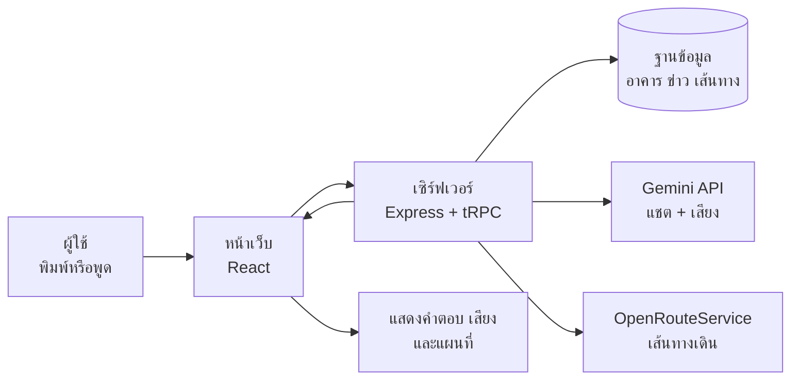

# น้องปลาทูออนทัวร์ (Nong Pla Too On Tour)

ระบบประชาสัมพันธ์อัจฉริยะของวิทยาลัยเทคนิคสมุทรสงคราม — ผู้มาติดต่อถามทางหรือถามข้อมูลวิทยาลัยกับ "น้องปลาทู" ได้ด้วยการพิมพ์หรือพูดภาษาไทย แล้วดูเส้นทางเดินไปยังอาคารบนแผนที่ได้ทันที

**ลองใช้งาน:** https://nong-pla-too.onrender.com/
(โฮสต์แบบฟรี ครั้งแรกที่เปิดอาจรอประมาณ 1 นาทีให้เซิร์ฟเวอร์ตื่น)

**รางวัล:** ชนะเลิศ เหรียญเงิน การประกวดสิ่งประดิษฐ์ของคนรุ่นใหม่ ระดับสถานศึกษา ปีการศึกษา 2569 (10 กันยายน 2569)

## ทำอะไรได้บ้าง

- **แชตบอตน้องปลาทู** — ตอบคำถามเรื่องอาคาร สาขาวิชา และข่าวของวิทยาลัย
- **พูดคุยด้วยเสียงภาษาไทย** — พูดถามได้ และน้องปลาทูตอบกลับเป็นเสียง
- **แผนที่และเส้นทางเดิน** — แสดงอาคารบนแผนที่ และวาดเส้นทางเดินไปยังอาคารที่ต้องการ
- **ข่าวประชาสัมพันธ์** — ดึงข่าวจากเว็บไซต์วิทยาลัยมาแสดงอัตโนมัติ
- **ระบบ admin** — เจ้าหน้าที่ล็อกอินเพื่อแก้ไขข้อมูลอาคาร เส้นทาง ข่าว และบัญชีผู้ใช้
- ใช้ได้ทั้งบนตู้ประชาสัมพันธ์ (Kiosk) และมือถือ

## ขั้นตอนการทำงาน



**เมื่อผู้ใช้ถามคำถาม เช่น "อาคารคอมพิวเตอร์ไปทางไหน"**

1. **รับคำถาม** — ผู้ใช้พิมพ์หรือกดไมโครโฟนพูด ถ้าเป็นเสียง เซิร์ฟเวอร์ส่งไฟล์เสียงให้ Gemini แปลงเป็นข้อความก่อน
2. **เตรียมข้อมูล** — เซิร์ฟเวอร์ดึงข้อมูลอาคาร ห้อง สาขา และข่าวล่าสุดจากฐานข้อมูล แล้วแนบไปกับคำถาม เพื่อให้ AI ตอบจากข้อมูลจริงของวิทยาลัย
3. **ให้ AI ตอบ** — ส่งคำถามพร้อมข้อมูลไปที่ Gemini ได้คำตอบเป็นข้อความภาษาไทย
4. **ตัดสินใจแสดงเส้นทาง** — ถ้าเป็นคำถามถามทาง Gemini จะเรียกเครื่องมือ `show_walking_route` พร้อมระบุอาคารปลายทาง
5. **คำนวณเส้นทาง** — เซิร์ฟเวอร์ขอเส้นทางเดินเท้าจาก OpenRouteService แล้วเก็บผลไว้ในแคช ครั้งต่อไปที่ถามเส้นทางเดิมจะตอบได้ทันที
6. **แสดงผล** — หน้าเว็บแสดงคำตอบ วาดเส้นทางบนแผนที่ และเล่นเสียงตอบที่ Gemini สังเคราะห์ให้

**งานที่ทำงานเบื้องหลังอัตโนมัติ**

- เซิร์ฟเวอร์เข้าไปอ่านหน้าข่าวของเว็บไซต์วิทยาลัย (sstc.ac.th) เป็นระยะ แล้วบันทึกข่าวใหม่ลงฐานข้อมูล
- จำกัดจำนวนคำขอเสียงต่อผู้ใช้ และแคชเสียงที่เคยสร้างแล้ว เพื่อไม่ให้โควตา API หมด
- API key ทั้งหมดเก็บไว้ฝั่งเซิร์ฟเวอร์ ไม่ส่งไปที่เบราว์เซอร์ของผู้ใช้

**ฝั่งเจ้าหน้าที่**

1. ล็อกอินที่หน้า `/admin` ด้วยชื่อผู้ใช้และรหัสผ่าน
2. แก้ไขข้อมูลอาคาร เส้นทางเดิน ข่าว หรือบัญชีเจ้าหน้าที่
3. ข้อมูลบันทึกลงฐานข้อมูล และแชตบอตใช้ข้อมูลใหม่ตอบคำถามครั้งถัดไปทันที

## เทคโนโลยีที่ใช้

| ส่วน | เทคโนโลยี |
| --- | --- |
| Frontend | React, Vite, TypeScript, Tailwind CSS, Leaflet (OpenStreetMap) |
| Backend | Node.js, Express, tRPC, TypeScript |
| ฐานข้อมูล | MySQL / TiDB ผ่าน Drizzle ORM |
| AI | Google Gemini API (แชต, แปลงเสียงเป็นข้อความ, สังเคราะห์เสียง) |
| แผนที่ | OpenRouteService (เส้นทางเดินเท้า) |
| Deploy | Render |

## โครงสร้างโค้ด

```
client/    หน้าเว็บ (React) — หน้า Kiosk, หน้ามือถือ, หน้า admin
server/    ระบบหลังบ้าน (Express + tRPC)
  chat.ts          แชตบอต: ส่งคำถามให้ Gemini พร้อมข้อมูลวิทยาลัย และเครื่องมือแสดงเส้นทาง
  voice.ts         เสียงพูด/ฟังภาษาไทย พร้อมจำกัดจำนวนคำขอและแคชผลลัพธ์
  walkingRoute.ts  ขอเส้นทางเดินจาก OpenRouteService
  newsScraper.ts   ดึงข่าวจากเว็บไซต์วิทยาลัย
  adminRouter.ts   API สำหรับเจ้าหน้าที่ และระบบล็อกอิน
  db.ts            คำสั่งฐานข้อมูล
drizzle/   โครงสร้างตารางและ migration
shared/    ข้อมูลและชนิดข้อมูลที่ใช้ร่วมกันทั้งสองฝั่ง
```

## วิธีรันบนเครื่อง

ต้องมี Node.js 20 ขึ้นไป และ pnpm

```bash
pnpm install
cp .env.example .env   # แล้วเติมค่าของตัวเอง
pnpm dev
```

จากนั้นเปิด http://localhost:3000

ค่าหลักใน `.env`

| ตัวแปร | ใช้ทำอะไร |
| --- | --- |
| `DATABASE_URL` | ฐานข้อมูล MySQL / TiDB (เว้นว่างได้ ระบบจะใช้ข้อมูลตัวอย่าง) |
| `GEMINI_API_KEY` | แชตบอตและเสียงพูด |
| `ORS_API_KEY` | เส้นทางเดินจาก OpenRouteService (ไม่บังคับ) |
| `ADMIN_USERNAME`, `ADMIN_PASSWORD` | บัญชีหลักสำหรับเข้าหน้า `/admin` |
| `JWT_SECRET` | กุญแจเซ็น cookie ล็อกอิน |

ห้าม commit ไฟล์ `.env` ขึ้น GitHub

## ผู้พัฒนาระบบหลังบ้าน

**นิติพันธ์ ลายทอง** — นักเรียน ปวช. สาขาเทคโนโลยีธุรกิจดิจิทัล วิทยาลัยเทคนิคสมุทรสงคราม

รับผิดชอบระบบหลังบ้าน (Backend) ทั้งหมดของโครงงาน:

- ออกแบบ API ด้วย Node.js, Express, tRPC และฐานข้อมูล MySQL
- เชื่อมต่อ Gemini API สำหรับแชตบอตและเสียงพูดภาษาไทย
- เชื่อมต่อ OpenRouteService เพื่อคำนวณเส้นทางเดินบนแผนที่
- ระบบดึงข่าวจากเว็บไซต์วิทยาลัย และระบบล็อกอินเจ้าหน้าที่
